## objects section

### 1

**appRoute**: objects  
**wordsToCorrect**:  

* Desagrupado: Sin grupo 
* Nao: No 
* Altitude: Altitud 
* Protocol: Protocolo 
* Driver: Conductor 
* Position: Posición 

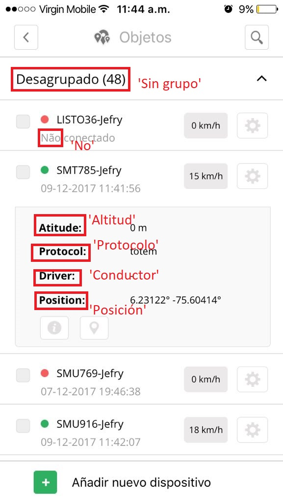

### 2

**appRoute**: objects -> info -> general  
**wordsToCorrect**:  

* Fora: Off 
* Driver's information: Información del conductor 

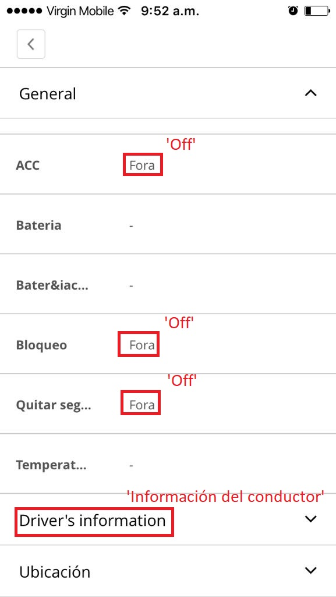

### 3

**appRoute**: objects -> info -> general  
**wordsToCorrect**:  

* Fora: Off 
* Em: On 
* \&deg;C: °C 

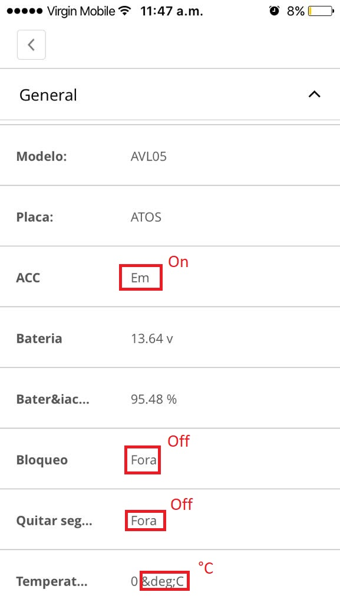

### 4

**appRoute**: objects -> info -> general  
**wordsToCorrect**:  

* Padrao: Predeterminado 

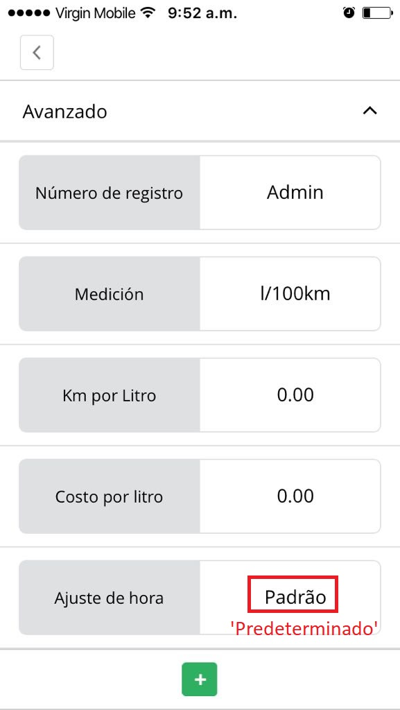

## -

## map section

### 1

**appRoute**: map  
**wordsToCorrect**:  

* Map: Mapa 
* Desligado: Off 
* &deg;C: °C 

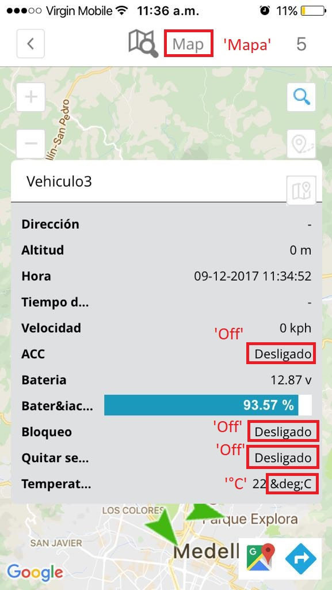

## -

## history section

### 1

**appRoute**: history  
**wordsToCorrect**:  

* start: inicio 
* stop: parada 
* drive: movimiento 
* Map: Mapa 
* Statistics: Estadísticas 

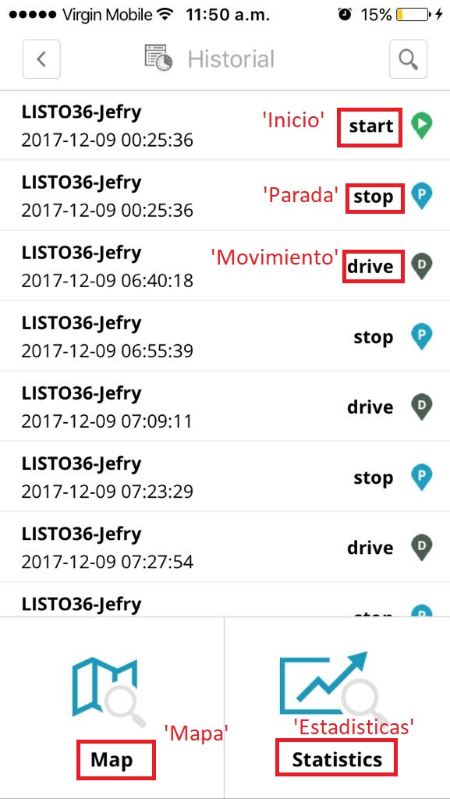

### 2

**appRoute**: history  
**wordsToCorrect**:  

* History log: historial 

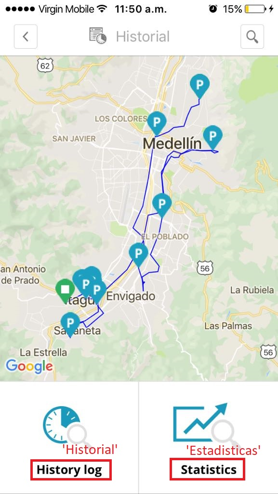

## -

## tools section

### 1

<h3>tools -> showPoint </h3>
<h4>wordsToCorrect:  </h4>

* Latitude: Latitud 
* Longitude: Longitud 

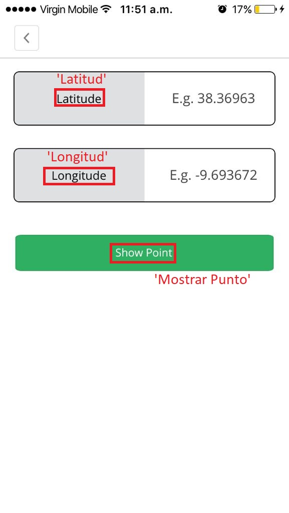

### 2

<h3>tools -> sendCommand -> GPRS </h3>
<h4>wordsToCorrect:  </h4>

* Braco alarme: Activar alarma 
* Send: Enviar 
* Desligar motor: Apagar motor 
* Ligar motor: Encender motor 
* Desarmar alarme: Desactivar alarma 
* Posicao unica: Posicion unica 

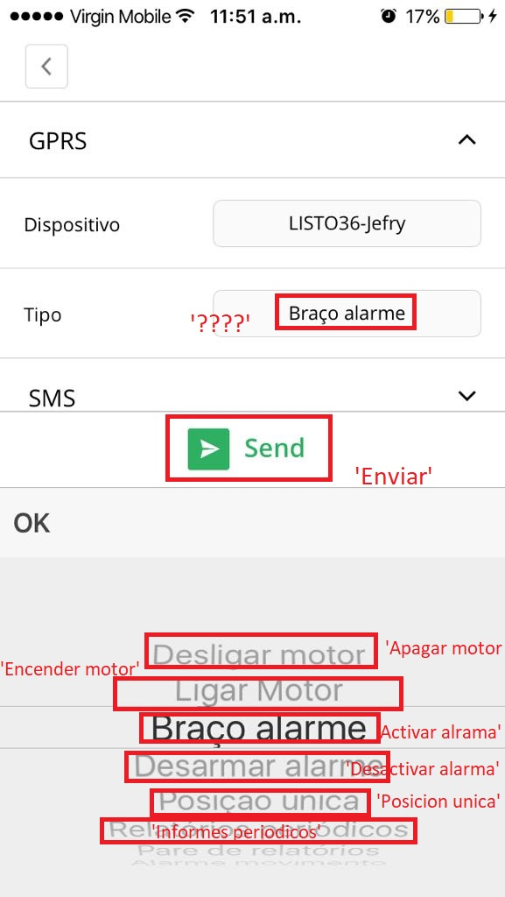

### 3

<h3>tools -> sendCommand -> GPRS </h3>
<h4>wordsToCorrect:  </h4>

* Relatorios periodicos: Reporte periodico 
* pare de relatorios: Deneter reporte 
* Alarme movimento: Alerta de movimiento 
* Definir fuso horario: Definir huso horario 
* Dispositivo de reinicializacao: Reiniciar dispositivo 
* Pedido Foto: Tomar foto 

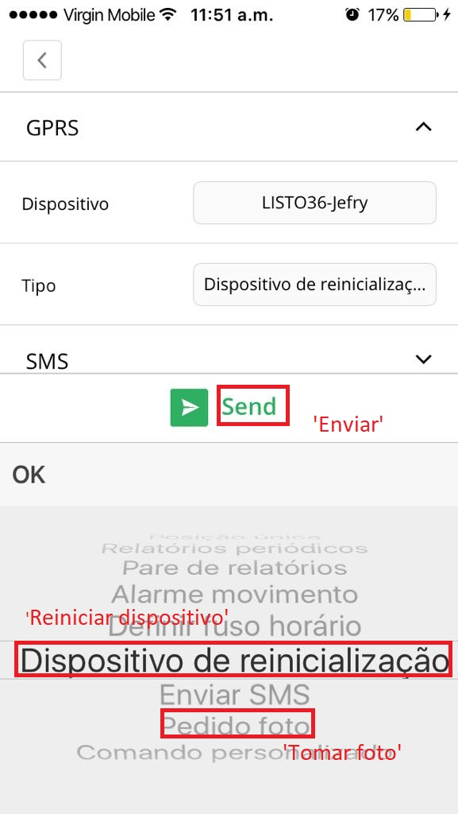

### 4

<h3>tools -> sendCommand -> SMS </h3>
<h4>wordsToCorrect:  </h4>

* Nenhum modelo: Sin plantilla 
* "SMS template" can be added at: Setup -> SMS templates: "Plantilla SMS" puede ser   añadida en: Configuracion -> Plantillas
* Devices: Dispositivos 

## -

## setup section

### 1

<h3>setup -> Main</h3>
<h4>wordsToCorrect:  </h4>

* Milha: Milla 

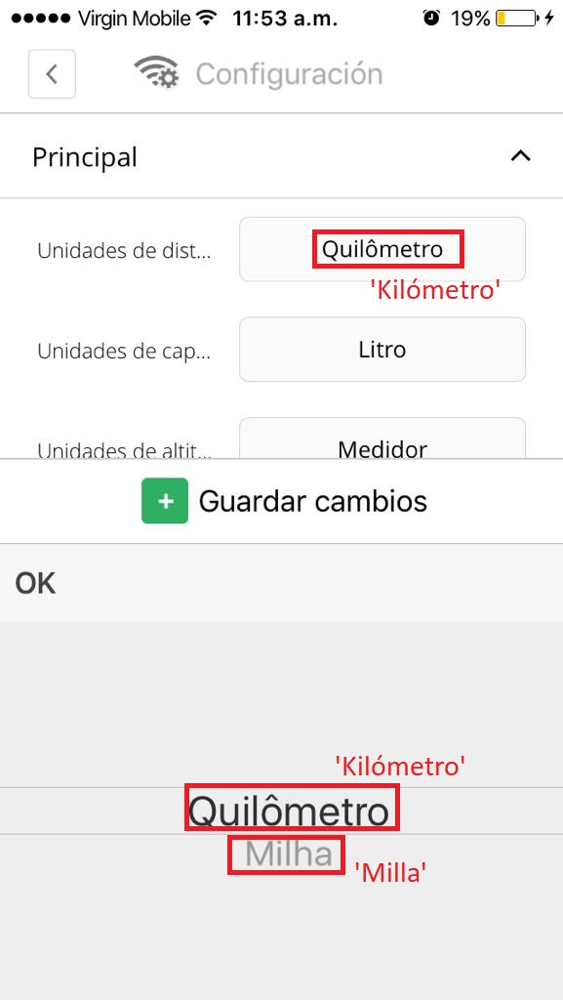

### 2

<h3>setup -> Main </h3>
<h4>wordsToCorrect:  </h4>

* Galao: Galón 

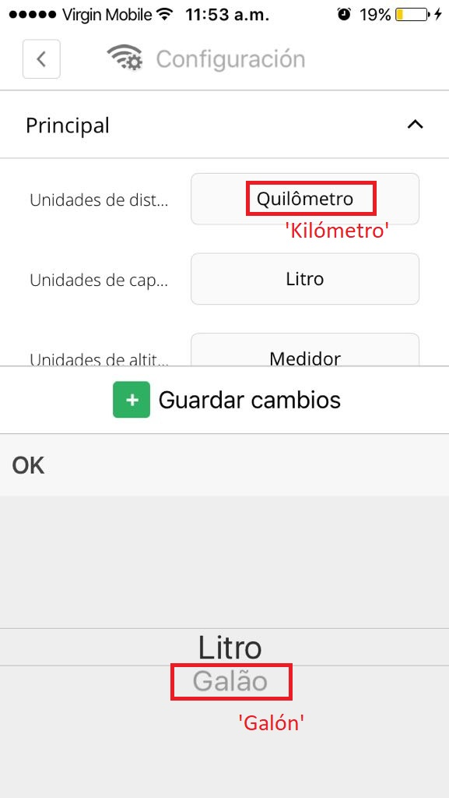

### 3

<h3>setup -> Main </h3>
<h4>wordsToCorrect:  </h4>

* Pes: Pies 

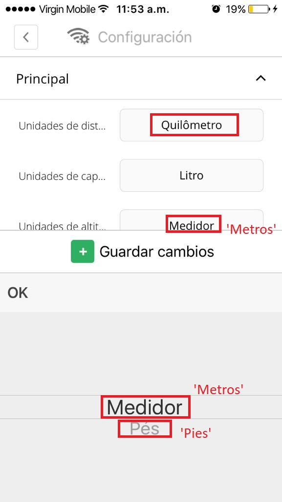

